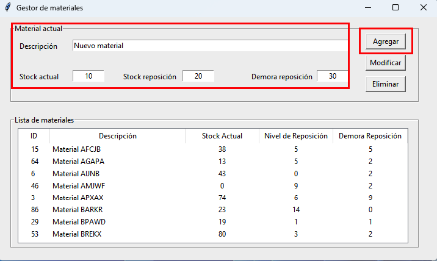
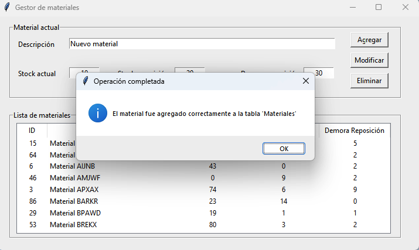
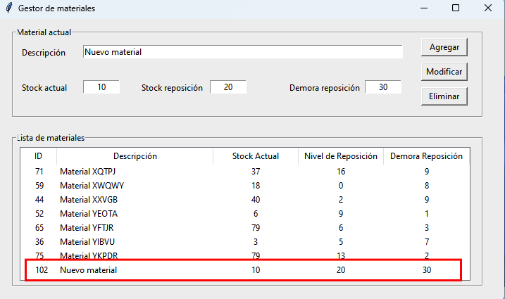

Alta de un material
===================

El proceso de alta de material inicia completando todos los campos de la sección *Material actual* y pulsando el botón **Agregar**. 
Si no existe actualmente un material con la descripción indicada, el material es agregado a la base de datos, de otra forma se
indica que el material ya existe (es duplicado) y no se agrega ningún registro.

|

|

|