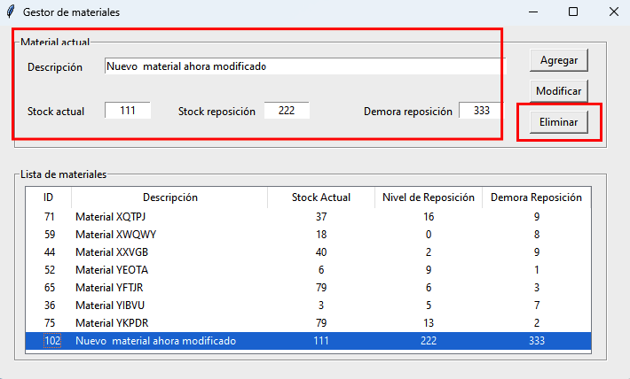
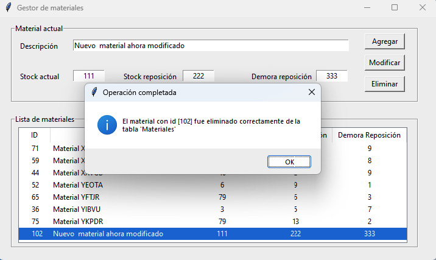

Eliminación de un material
==========================

Realizando un doble click sobre un material mostrado en la sección *Lista de materiales*, los valores del material son cargados en la sección *Material actual*.
Dicho material puede ser eliminado (aún si se ha modificado alguno de sus campos en la sección *Material actual* y los cambios no fueron guardados)
presionando el botón **Eliminar**.
Atención: la eliminación del material de la base de datos es irreversible.

|

