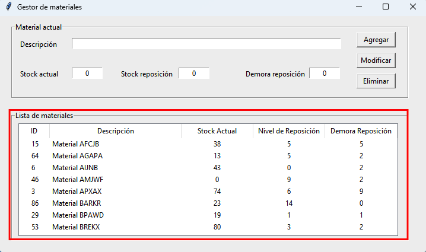

Introducción
============

La aplicación permite realizar la gestión de materiales, definiendo los precedimientos para crear, leer, actualizar y eliminar (CRUD) registros de una tabla de materiales.

Al iniciar la aplicación, se cargan todos los materiales existentes desde la base de datos hacia la lista de materiales:

En la parte superior de la pantalle se encuentra el editor del *Material actual*, compuesto por los siguientes campos:

- Descripción: identificación del material. Solo admite caracteres alfabéticos (letras y espacios en blanco).

- Stock actual: cantidad de unidades en existencia del material. Solo admite dígitos numéricos (0 a 9).

- Stock reposición: cantidad de unidades en stock a partir de la cual se dispara el pedido de reposición del material. Solo admite dígitos numéricos (0 a 9).

- Demora reposición: cantidad de días que transcurren desde que se realiza el pedido de reposición de stock y el momento en el cual el proveedor entrega el pedido (demora). Solo admite dígitos numéricos (0 a 9).
